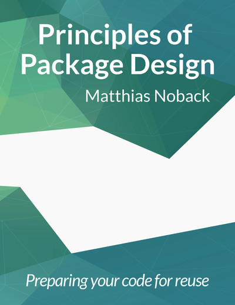
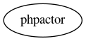
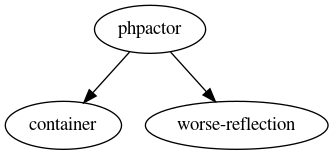
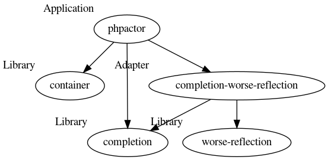
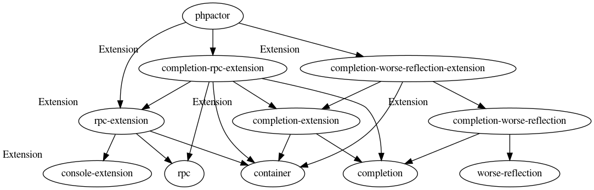
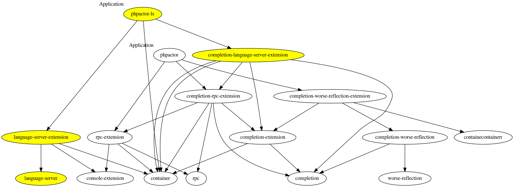
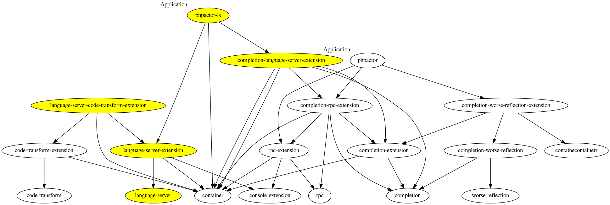
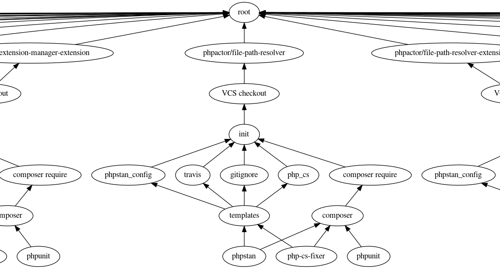

# Principles of Object Design

## Principles of Package Design



## Principles of Object Oriented Design (OOD)

:::::::::::::: {.columns}
::: {.column width="50%"}

### SOLID

- **S**ingle Responsibility
- **O**pen closed
- **L**iskov Substitution
- **I**nterface Segrgation
- **D**ependency Inversion

:::
::: {.column width="50%"}

### Package Cohesion

- Release Reuse Principle
- Common Closure Principle
- Common Reuse Principle

### Package Coupling

- Acyclic Dependencies
- Stable Dependencies
- Stable Abstractions

:::
::::::::::::::

# Package Cohesion

::: notes

How cohesive,f

:::

## Release Reuse Principle

> "The granule of reuse is the granule of release"

---


::: notes

- Only packages that are released through a tracking system can be reused.
- ... we have composer.

:::

## Common Reuse Principle

> "The classes in a package are reused together."

---


::: notes

- Packages should not have irrelevant classes.
- Package shouldn't be changed due to irrelevant classes.
- Single Responsibility Principle
- Library / UI / Controllers / Framework?

:::

## Common Closure Principle

> "Classes should be closed against the same type of change"

---


---


::: notes

- Related to the open closed principle.
- Monolog example
- Package shouldn't be changed due to irrelevant classes.
- Single Responsibility Principle

:::

# Package Coupling

## Acyclic Dependencies

> Packages should should have no dependency cycles

## Stable Dependencies

> Packages should depend on other packages that are more stable than themselves

::: incremental

Positional Stability = Incoming Couplings / (Outgoing Couplings + Incoming Couplings)
Package with no outgoing dependencies is stable and _responsible_

:::

## Stable Domain

> Maximally stable packages are maximally abstract. Unstable packages are concrete. The abstraction of a package is proportionate to its stability.

- Abstractness = Abstract Classes / Total Classes
- Package which has only abstract classes is stable

Phpactor
========

## Phpactor

- Auto completion
- Navigation
- Refactoring/Generation

## In the beginning



## Extracting libraries



## Extracting abstractions



## Extracting framework couplings



## Adding a new distribution



## Adding a new feature for new distribution



# Phpactor currently has 40 packages

# Theoretically it will have 100s

# Spryker has 936 (!!)

---


## Benefits

::: incremental

- Harder to break domain boundaries
- Primary concern in the package space
- Anything goes in space
- Securing investment
  - When the planet destroys itself,
  - Satellites can move to new planet

:::

## Problems

::: incremental

- Inflexibility
- Config synchronization
- Releasing
- Package creation overhead
- Cross-cutting changes (e.g. library, extension + planet)

:::

Maestro
=======

# Asynchronous Workspace Based Package Orchestration Tool (AWBPOT)

## What should it do?

::: incremental

- Config synchronization
- Composer file management
- Release packages
- Create packages
- Run scripts (unit tests etc)
- Perform automated refactorings

:::

## What does it do?

::: incremental

- Config synchronization
- Composer file management?
- Release packages?
- ~~Create packages~~
- Perform automated refactorings?
- Run unit tests etc.

:::

## What else does it do?

- Start TMUX sessions!
- Produces version survey report

## What it look like?

```javascript
{
    "packages": {
        "phpactor/class-mover": {
            "version": "0.1.1",
            "prototype": "default",
            "vars": {
                "phpstan_level": 4,
                "phpstan_ignore": [
                    "'#Microsoft.PhpParser.Node::getText.* invoked with 1 parameter, 0 required#'"
                ]
            }
        },
        "phpactor/class-to-file": {
            "prototype": "default",
            "version": "0.3.1",
            "vars": {
                "php_cs_fixer_ignore_dirs": [
                    "Integration/Composer/project"
                ]
            }
        },
        "phpactor/class-to-file-extension": {
            "prototype": "default",
            "version": "0.2.1",
            "tags": [ "extension" ]
        }
    }
}
```

## What it look like?

```javascript
"tasks": {
    "init": {
        "type": "null"
    },
    "travis": {
        "type": "template",
        "args": {
            "path": "maestro/travis.yml",
            "targetPath": ".travis.yml"
        },
        "depends": ["init"]
    },
    "gitignore": {
        "type": "template",
        "args": {
            "path": "maestro/gitignore",
            "targetPath": ".gitignore"
        },
        "depends": ["init"]
    },
    "php_cs": {
        "type": "template",
        "args": {
            "path": "maestro/php_cs.dist",
            "targetPath": ".php_cs.dist"
        },
        "depends": ["init"]
    }
}
```

## What it look like?



# Demo

## Thoughts

::: incremental

- Satellite packages require tooling to scale.
- Monorepositories puts all eggs in basket.
- Compromise.

:::

## Links

- Post from Bob Martin o Principles of OOD (1995): https://groups.google.com/forum/?hl=en#!topic/comp.object/WICPDcXAMG8
- Principles of OOD: http://butunclebob.com/ArticleS.UncleBob.PrinciplesOfOod
- Explanation of principles of cohesion: https://medium.com/@fagnerbrack/why-do-you-need-to-know-package-cohesion-fundamentals-8a3510cba2c1

